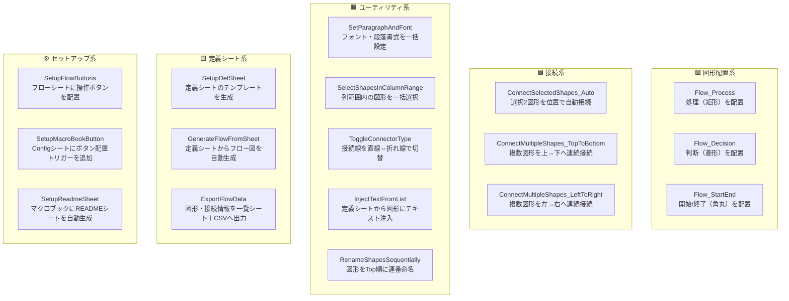

# Mermaid 構造図 - ThisWorkbook.cls
> 生成日: 2026-03-25
> 対象: vba-files/Class/ThisWorkbook.cls

---

## 【図1】公開関数グループ図（README用）

**この図の読み方：** ボタンから直接呼び出せる公開マクロを役割ごとにグループ化しています。内部の処理は省略しており、「何ができるか」の全体像を把握するための図です。

---

## 【図2】全体詳細図（技術解説書用）

```mermaid
graph TD
    subgraph PUB["📢 公開マクロ"]
        subgraph G1["図形配置系"]
            FP["Flow_Process"]
            FD["Flow_Decision"]
            FSE["Flow_StartEnd"]
        end
        subgraph G2["接続系"]
            CSA["ConnectSelectedShapes_Auto"]
            CMTB["ConnectMultipleShapes_TopToBottom"]
            CMLR["ConnectMultipleShapes_LeftToRight"]
        end
        subgraph G3["ユーティリティ系"]
            SPF["SetParagraphAndFont"]
            SSCR["SelectShapesInColumnRange"]
            TCT["ToggleConnectorType"]
            ITL["InjectTextFromList"]
            RSS["RenameShapesSequentially"]
        end
        subgraph G4["定義シート系"]
            SDS["SetupDefSheet"]
            GFF["GenerateFlowFromSheet"]
            EFD["ExportFlowData"]
        end
        subgraph G5["セットアップ系"]
            SFB["SetupFlowButtons"]
            SMBB["SetupMacroBookButton"]
            SRS["SetupReadmeSheet"]
        end
    end

    subgraph PRI["🔒 内部ヘルパー"]
        subgraph H1["設定・シート解決"]
            LC["LoadConfig"]
            GCV["GetConfigValue"]
            GTS["GetTargetSheet"]
            FA["Flow_AddShape"]
        end
        subgraph H2["図形スタイル・判定"]
            FS["FlowStyle"]
            IBS["IsButtonShape"]
            GSK["GetShapeKind"]
        end
        subgraph H3["接続処理"]
            CAP["ConnectAutoByPosition"]
            CTV["ConnectTwoShapes_Vertical"]
            CTH["ConnectTwoShapes_Horizontal"]
            CT["ConnectTwoShapes"]
        end
        subgraph H4["配列・ソート"]
            GSS["GetSelectedShapes"]
            SBA["SortShapesByAxis"]
        end
        subgraph H5["エクスポート"]
            ESL["ExportShapeList"]
            WSC["WriteShapeListCsv"]
            ECF["EscapeCsvField"]
            TTR["TopToRowNum"]
            LCL["LeftToColLetter"]
        end
    end

    FP & FD & FSE --> FA
    FA --> LC & GTS & FS

    CSA --> LC & CAP
    CMTB --> LC & GSS & SBA & CTV
    CMLR --> LC & GSS & SBA & CTH
    CAP --> CTV & CTH
    CTV & CTH --> CT
    CT --> GTS

    SPF & TCT --> LC
    SSCR --> LC & GTS
    ITL --> LC & GTS & FS
    RSS --> LC & GTS & IBS & SBA & GSK & ESL

    SDS & GFF --> LC & GTS & IBS
    GFF --> FS & CAP
    EFD --> LC & GTS & IBS & SBA & ESL & WSC

    SFB & SMBB & SRS --> LC & GTS

    LC --> GCV
    ESL & WSC --> GSK & TTR & LCL & ECF
```

**主要な処理フロー：**
- **図形配置：** 公開Sub → Flow_AddShape → LoadConfig + GetTargetSheet + FlowStyle
- **接続：** 公開Sub → ConnectAutoByPosition → ConnectTwoShapes_Vertical/Horizontal → ConnectTwoShapes → GetTargetSheet
- **フロー自動生成：** GenerateFlowFromSheet → 図形配置(FlowStyle) + 接続(ConnectAutoByPosition) を内部でまとめて実行
- **エクスポート：** ExportFlowData → ExportShapeList + WriteShapeListCsv → 位置変換ヘルパー群
- **全公開Sub共通：** LoadConfig（Config読み込み）→ GetTargetSheet（操作対象シート解決）の2ステップが必ず先頭に来る
