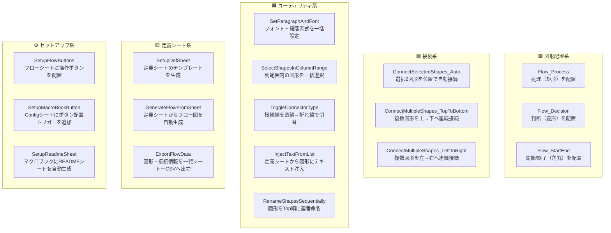

# 業務フロー図形マクロ

Excelシート上に業務フローの図形・コネクタを作成するマクロ集。
マクロを直接埋め込まない業務フロー用Excelブックを、このマクロブックのボタンから外部操作する設計。

---

## 前提条件・セットアップ

### 必要なファイル構成

```
マクロブック（このファイル）
  └─ Config シート       ← ブック名・シート名を設定する
業務フローブック（操作対象）
  └─ フローシート        ← 図形を配置するシート
  └─ 定義シート          ← フロー自動生成の入力データ（任意）
  └─ 図形一覧シート      ← エクスポート先（自動生成）
```

### Config シートの設定

| 設定名 | 内容 | 例 |
|---|---|---|
| 対象ブックキーワード | 業務フローブックのファイル名に含まれる文字列 | `業務フロー` |
| フローシート名 | 図形を配置するシート名 | `フロー図` |
| 定義シート名 | フロー自動生成の入力シート名 | `フロー定義` |
| 一覧シート名 | エクスポート先シート名 | `図形一覧` |

### ボタンの初期配置手順

1. マクロブックの Config シートで「ボタン配置」ボタンを押す（`SetupMacroBookButton`）
2. 業務フローブックのフローシートで「ボタン配置」を押す（`SetupFlowButtons`）
3. フローシート上部に全14個のボタンが横並びで配置される

---

## 使い方

### 基本フロー（手動で図形を作る場合）

```
1. フローシートで配置したいセルをクリック
2. 「処理」「判断」「開始/終了」ボタンで図形を配置
3. 接続したい2図形を Ctrl+クリックで選択
4. 「自動接続」ボタンで接続線を引く
5. 「連番命名」で図形に連番名を付ける（テキスト注入の前に必要）
6. 定義シートにテキストを記入して「テキスト注入」で一括入力
```

### 定義シートからフローを自動生成する場合

```
1. 「定義作成」で定義シートのテンプレートを生成
2. 定義シートに図形名・テキスト・種別・接続先を入力
3. 「フロー生成」でフローシートに図形と接続線を一括配置
4. 必要に応じて「フロー出力」で図形情報をCSVエクスポート
```

### ボタン一覧

| ボタン | マクロ名 | 説明 |
|---|---|---|
| 処理 | `Flow_Process` | 矩形（処理）を選択セル位置に配置 |
| 判断 | `Flow_Decision` | 菱形（判断）を選択セル位置に配置 |
| 開始/終了 | `Flow_StartEnd` | 角丸矩形（開始/終了）を選択セル位置に配置 |
| 自動接続 | `ConnectSelectedShapes_Auto` | 選択した2図形を位置関係で自動接続 |
| 縦連続接続 | `ConnectMultipleShapes_TopToBottom` | 選択した複数図形を上→下へ連続接続 |
| 横連続接続 | `ConnectMultipleShapes_LeftToRight` | 選択した複数図形を左→右へ連続接続 |
| フォント設定 | `SetParagraphAndFont` | 選択図形のフォント・段落書式を一括設定 |
| 列範囲選択 | `SelectShapesInColumnRange` | 指定した列範囲内の図形を一括選択 |
| 接続線切替 | `ToggleConnectorType` | 接続線を直線⇔折れ線で切り替え |
| テキスト注入 | `InjectTextFromList` | 定義シートのリストから図形にテキストを一括注入 |
| 連番命名 | `RenameShapesSequentially` | 図形をTop順に `FLOW_{種別}_{連番}` で命名 |
| 定義作成 | `SetupDefSheet` | フロー定義シートのテンプレートを自動生成 |
| フロー生成 | `GenerateFlowFromSheet` | 定義シートからフロー図を一括生成 |
| フロー出力 | `ExportFlowData` | 図形・接続情報を一覧シート＋CSVへ出力 |

---

## できること一覧



### 実装状況

| 機能 | 状態 | 概要 |
|---|---|---|
| 図形配置（処理/判断/開始終了） | ✅ | 選択セル位置にフロー図形を配置。スタイル（色・フォント）を自動適用 |
| 自動接続 | ✅ | 2図形の位置関係（縦/横）を判定してコネクタで接続 |
| 複数図形の連続接続 | ✅ | 選択した複数図形を上→下または左→右へ順番に接続 |
| フォント・段落書式の一括設定 | ✅ | 選択した図形のフォント名・サイズ・行間・インデントを統一 |
| 列範囲選択 | ✅ | 指定した列範囲内にある図形をまとめて選択状態にする |
| 接続線の種類切替 | ✅ | 選択した接続線を直線⇔折れ線でトグル切替 |
| 連番命名 | ✅ | 図形をTop座標順に `FLOW_{種別}_{連番3桁}` 形式で命名 |
| テキスト一括注入 | ✅ | 定義シートの図形名・テキスト対応表から図形にテキストを一括設定 |
| 定義シートのテンプレート生成 | ✅ | フロー自動生成の入力フォーマットを持つシートをワンクリックで作成 |
| フロー自動生成 | ✅ | 定義シートを読み込んで図形配置・命名・接続線を一括実行 |
| フロー情報エクスポート | ✅ | 図形名・テキスト・種別・位置・接続先を一覧シートとCSVに出力 |
| ボタン自動配置 | ✅ | フローシート上部に全操作ボタンを色分けして横1行配置 |
| READMEシート自動生成 | ✅ | マクロブック内にマクロ一覧・使い方を記載したシートを生成 |
| 今後追加予定の機能 | 📋 | （現時点では未定） |

---

## カスタマイズ

図形サイズ・色・フォントはコード冒頭の「設定定数」セクションで一括変更できる。

```vba
' --- 処理・判断図形サイズ（センチメートル）---
Private Const SHAPE_WIDTH_CM  As Double = 2.5
Private Const SHAPE_HEIGHT_CM As Double = 1.2

' --- 図形の塗り色（RGB）---
Private Const FILL_R As Long = 255
Private Const FILL_G As Long = 255
Private Const FILL_B As Long = 255

' --- フォント設定 ---
Private Const FONT_NAME As String = "Meiryo UI"
Private Const FONT_SIZE As Single = 9
```

---

> 開発環境・エンコーディング・VBEとのワークフローについては [DEVELOPMENT.md](DEVELOPMENT.md) を参照。
