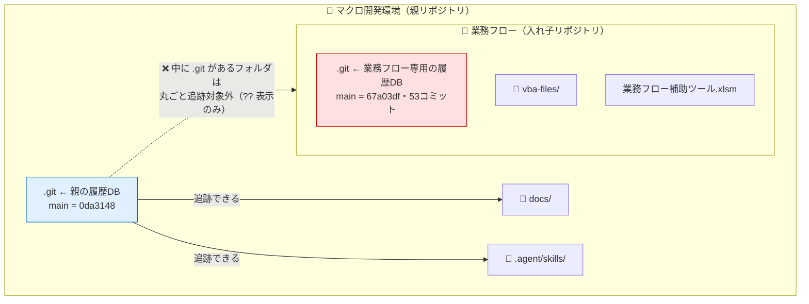
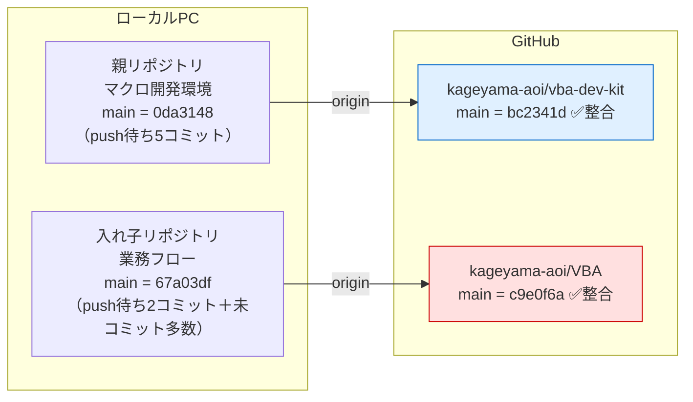
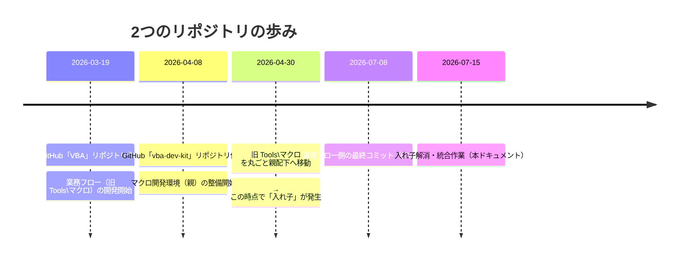
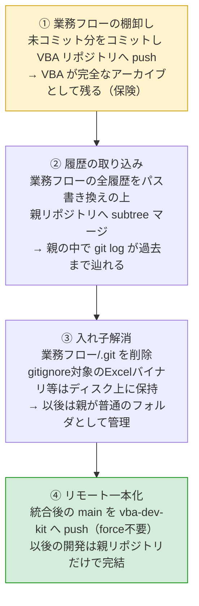
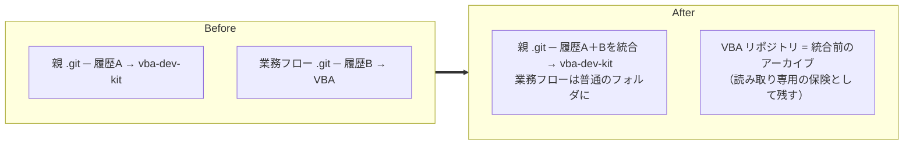

# git入れ子リポジトリ問題 — 状況図解

作成日: 2026-07-15（同日訂正: 当初「リモート共有による履歴上書き」と誤診していたが、正しくは「リモート2本立て」。§7参照）
対象: `マクロ開発環境`（親リポジトリ）と `業務フロー`（入れ子リポジトリ）
関連Issue: vba-dev-kit#7

---

## 0. 3行まとめ

1. `業務フロー` フォルダの中に独自の `.git` があり、親リポジトリからは中身を**一切管理できていない**（入れ子リポジトリ）
2. 親は `vba-dev-kit`、業務フローは `VBA` と、**それぞれ別のGitHubリポジトリ**へpushしており、管理が2系統に分裂している
3. 履歴の消失や競合は**起きていない**。やることは「業務フローの履歴を親に取り込み、入れ子を解消し、リモートを親に一本化する」こと

---

## 1. 物理構成 — 「入れ子」とはどういう状態か

**ポイント**: gitは「リポジトリの中のリポジトリ」の中身を親側で追跡できない仕様。
親の `git status` に `?? 業務フロー/` と1行だけ出るのはこのため。
業務フロー内でいくらコミットしても、親の履歴には何も記録されない。

---

## 2. リモート構成 — 実は2系統に分裂していた

**ポイント**: それぞれのローカルとリモートは正しく対応しており、履歴の矛盾はない。
問題は「1つの開発環境なのにGitHub上の置き場が2つある」こと。
親の `.gitignore` を見ると `excel-image-importer/` など「意図的に別リポジトリ管理」のフォルダは明示的に除外されているが、
`業務フロー` はそこに載っておらず、**分離が意図されたものではない**（歴史的経緯で入れ子になっただけ）と分かる。

---

## 3. 経緯（タイムスタンプからの推定）

※ 移動の痕跡: 業務フロー内の `CLAUDE.md` や hooks 設定が旧パス `C:\Users\kageyama\Tools\マクロ` を参照したまま残っている。

---

## 4. 統合前の各リポジトリの状態

| | 親（マクロ開発環境） | 業務フロー |
|---|---|---|
| main の位置 | 0da3148 | 67a03df（53コミット） |
| origin | vba-dev-kit | VBA |
| origin との整合 | ✅ ahead 5（push漏れのみ） | ✅ ahead 2（push漏れのみ） |
| 未コミットの変更 | あり（本MD等） | あり（修正3＋未追跡十数ファイル） |

---

## 5. 統合プラン（4ステップ）

### Before / After

### 履歴取り込みの方式 — filter-repo でパス書き換えしてからマージ

実施した手順（2026-07-15）:

1. `git filter-repo --to-subdirectory-filter 業務フロー` — 別クローン上で、**54コミット全部のパス**を `業務フロー/` 配下に書き換え
2. 親リポジトリで `git merge -s ours --no-commit --allow-unrelated-histories` ＋ `git read-tree --prefix=業務フロー/` で合流

なお、より手軽な `git subtree add` も試したが**不採用**とした。subtree add はマージコミットの
時点でだけツリーを繋ぐ方式で、過去コミットのパスは書き換えないため、
`git log -- 業務フロー/ファイル名` によるファイル単位の履歴追跡がマージ地点で止まってしまう。
filter-repo 方式なら `git log -- 業務フロー/README.md` が Initial commit まで一気通貫で辿れる。

補足: 旧履歴のコミットメッセージ中の Issue 番号（#41 等）は旧 VBA リポジトリの Issue を指すが、
GitHub 上では vba-dev-kit の同番号 Issue へ自動リンクされてしまう点は許容した（原本は VBA リポジトリで参照可能）。

---

## 6. 今後のための教訓

1. **リポジトリの中で `git init` / `git clone` をしない・リポジトリごとフォルダ移動しない**
   親の `git status` に `?? フォルダ名/` と1行だけ出ていたら入れ子のサイン。中身が全く管理されていない。
   今回は「旧 Tools\マクロ を親フォルダ配下へ移動」した時点で入れ子が発生した。

2. **意図的に別リポジトリで管理するなら、親の `.gitignore` に明示する**
   `excel-image-importer/` 等はこの運用ができていた。明示リストに無い入れ子は「事故」と判別できる。

3. **`origin/main` 表示はキャッシュ。信じる前に fetch**
   push/fetch した時点のスナップショットであり、リモートの今の状態ではない。長期間 push していないと「ahead 5」のような表示だけが積み上がる。

4. **履歴を消さずに統合する道具がある**
   スナップショットだけ持ってくる（`.git` 削除→add）と履歴が途切れるが、subtree マージなら全履歴ごと合流できる。統合前に旧リポジトリへ push しておけば、何かあっても戻れる。

---

## 7. 【訂正記録】当初の誤診とその原因

本ドキュメントの初版は「親と業務フローが**同じ**リモート（VBA.git）を共有し、
親のpush済み履歴がGitHub上で上書き消失した」と説明していたが、これは**誤り**だった。

- **誤診の原因**: 調査時、シェルの**カレントディレクトリが業務フロー側に残ったまま**親リポジトリのつもりで `git remote -v` を実行し、業務フローのリモート（VBA.git）を親のリモートと誤認した
- **発覚の経緯**: `gh issue create` が意図しないリポジトリ（vba-dev-kit）にIssueを作成したことから再調査し、親の origin が vba-dev-kit であることが判明した
- **教訓**: 複数リポジトリをまたいで調査するときは、コマンドごとに絶対パスで `cd` するか `git -C <パス>` を使い、「どのリポジトリに対する結果か」を常に明示する
