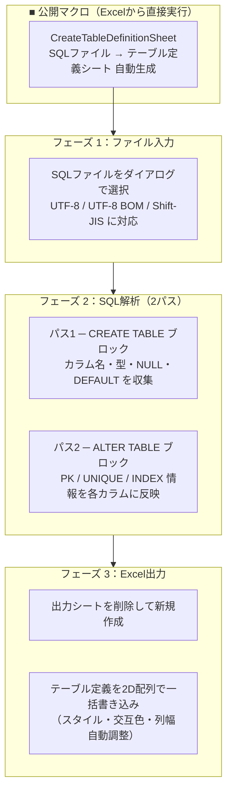
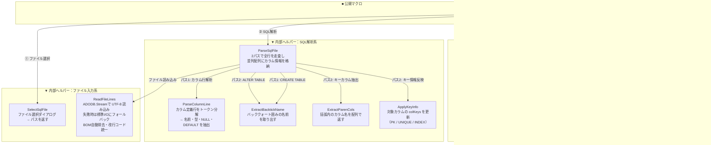

# Mermaid 構造図 - Sql_Table_Formatter.cls
> 生成日: 2026-04-14
> 対象: mysql-table-definition-to-excel/src/Sql_Table_Formatter.cls

---

## 【図1】公開マクロ グループ図

> README や概要説明に貼る。全体像を一目で把握するための図。

**この図の読み方**
- このモジュールの公開マクロは `CreateTableDefinitionSheet` の1つのみです。
- 大きく「入力 → 解析 → 出力」の3フェーズで処理が進みます。
- 解析は2パス構成で、まずカラム定義、次にキー情報を取得します。

---

## 【図2】全体詳細図

> 技術解説・コードリーディング時の地図。内部構造まで把握するための図。

**主要な処理フロー**

1. **エントリポイント** `CreateTableDefinitionSheet` が Application の描画・計算・イベントを停止し、高速処理モードに切り替える。
2. **ファイル読み込み** `ReadFileLines` は ADODB.Stream で UTF-8 読み込みを試み、失敗時は標準VBA I/Oにフォールバックする。BOM除去・改行コード統一も行う。
3. **2パス解析** `ParseSqlFile` はファイル全行を2周する。1周目で CREATE TABLE からカラム属性を収集、2周目で ALTER TABLE から PK / INDEX を対応カラムに追記する。
4. **一括書き込み** `WriteDefinitions` はカラムデータを 2D Variant 配列に詰めてから `Range.Value = array` で1回書き込む（セル単体へのCOM呼び出しを大幅削減）。
5. **後処理** エラー有無にかかわらず `Cleanup` ラベルで ScreenUpdating / Calculation / EnableEvents を必ず復元する。
